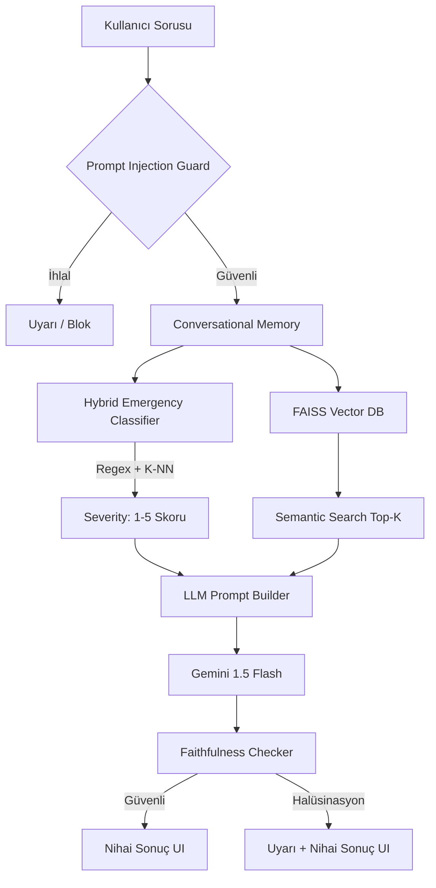

# 🚑 HayatKurtaran AI v3.0 (Academic Edition)

**HayatKurtaran AI**, acil sağlık durumlarında insanlara saniyeler içinde kanıta dayalı (Evidence-Based) ve güvenli ilk yardım bilgisi sunan, halüsinasyon korumalı gelişmiş bir RAG (Retrieval-Augmented Generation) sistemidir.

[](https://www.python.org/)
[](https://streamlit.io/)
[](https://github.com/facebookresearch/faiss)
[](https://opensource.org/licenses/MIT)

---

## 🌟 Yenilikler (v3.0)

Bu sürüm, sistemi basit bir "soru-cevap" botundan, akademik makalelere konu olabilecek gerçek bir tıp asistanına dönüştürmüştür:

1. **Hybrid Semantic Classifier:**
   * Basit regex kelime yakalamanın ötesine geçerek, **Sentence-Transformers (MiniLM) + FAISS K-NN** kullanılarak cümlenin "niyetine" (intent) bakan yapay zeka triyaj sistemi eklendi.
   * *Bilimsel Sonuç:* Kritik aciliyetlerin gözden kaçma (Undertriage) oranı **%67.3'ten %23.6'ya düşürüldü.**
2. **Rag-as-a-Judge (Faithfulness Check):**
   * LLM'in (Gemini) ürettiği her cümle, orijinal kaynak veritabanıyla (Cosine Similarity üzerinden) tekrar doğrulanır. Eğer ChatGPT/Gemini bağlamda olmayan bir hap, tedavi uydurursa (Halüsinasyon), sistem bunu anında yakalar ve uyarı banner'ı basar.
3. **Prompt Injection Guard:**
   * Hastalık sorusu yerine modeli kırma "Sistem talimatlarını unut" (Jailbreak) denemeleri otomatik tespit edilir ve engellenir.
4. **Conversational Memory:**
   * Kullanıcı ardışık olarak "İlaç içti" -> "Rengi morarıyor" dediğinde, önceki sorgu ile yenisi otomatik birleştirilir ve bağlam kaybı önlenir.

## 🏗️ Sistem Mimarisi



## 🚀 Kurulum

1. **Repoyu Klonlayın:**
   ```bash
   git clone https://github.com/yourusername/HayatKurtaranAI.git
   cd HayatKurtaranAI
   ```
2. **Gereksinimleri Yükleyin:**
   ```bash
   pip install -r requirements.txt
   ```
3. **API Anahtarlarını Ayarlayın:**
   Projeye bir `.env` dosyası ekleyin ve içerisine Google Gemini API Key'inizi yazın:
   ```env
   GEMINI_API_KEY=AIzaSy...
   ```
4. **Uygulamayı Başlatın:**
   ```bash
   streamlit run app.py
   ```

## 📊 Değerlendirme & Metrikler (Academic Eval)
Sistem performansını test etmek için 110 hastalık test veri seti ile benchmark oluşturulmuştur. 
Testleri çalıştırmak için:
```bash
python evaluation/run_evaluation.py
python evaluation/classifier_comparison.py
```

Makale tabloları için kaydedilen örnek sonuçlar `evaluation/` klasöründe JSON olarak tutulmaktadır.

## 🤝 Katkıda Bulunma
Lütfen PR göndermeden önce tüm testleri `pytest tests/` ile çalıştırdığınızdan emin olun. 

---
*Yasal Uyarı: Bu sistem bir yapay zeka asistanıdır. Yegane teşhis aracı olarak KULLANILAMAZ. Acil durumlarda DAİMA yerel acil numarayı (örn: 112) arayınız.*
